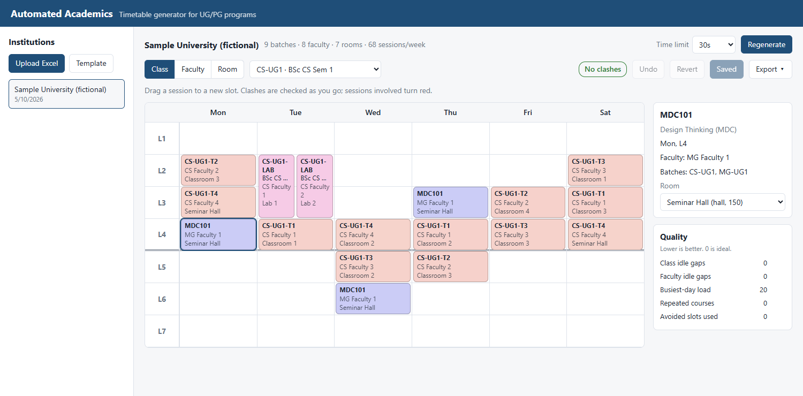
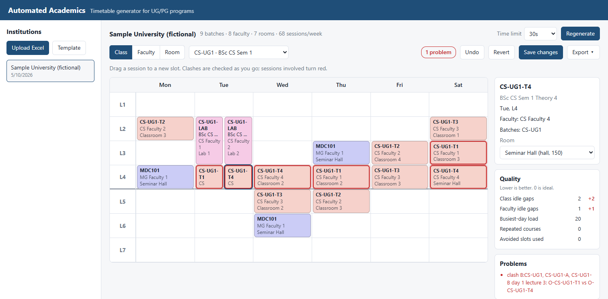
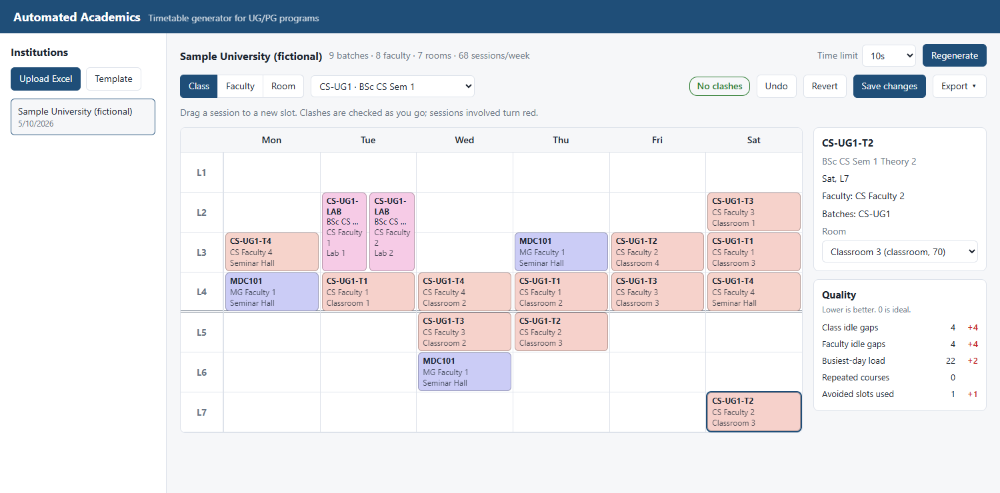
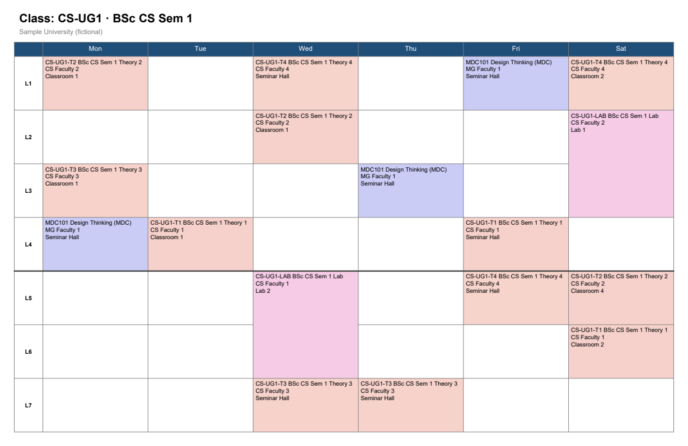
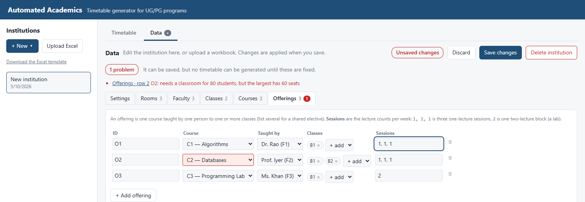
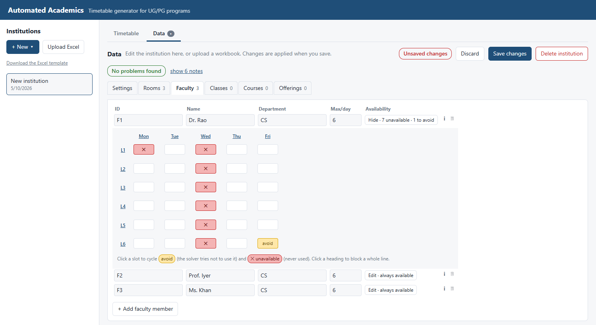

# Automated Academics

Open-source timetable generator for colleges and universities running UG and PG programs.
It models the realities of Indian higher education (CBCS / NEP 2020) and uses a
constraint solver (Google OR-Tools CP-SAT) to produce clash-free timetables.

> **Status: v0.2.0 released; `main` adds in-app data entry** (see the [changelog](CHANGELOG.md)). The
> full loop works end to end: enter an institution's data in the browser (or load it from Excel),
> generate a clash-free timetable that is also compact and well balanced, view and edit it with live
> clash and quality checking, and export to PDF and Excel. It has been tested on fictional
> institutions only; see [Known limitations](#known-limitations) before using it with real data.



Drag a session to a new slot and the server re-checks clashes as you go; sessions involved turn red
and the reasons are listed:



A move can be valid yet make the timetable worse. The **Quality** panel shows how every goal
changed against the saved version (here: more idle gaps and a lecture in a slot a teacher wanted to avoid):



Exports are print-ready (landscape A4, one page per class, faculty member and room):



## What it handles today

- Weekly grid with configurable days, lectures and breaks (blocks never span lunch)
- Faculty, rooms (classroom / lab / hall), batches and courses across departments
- **Shared electives**: one offering attended by batches from several programs (MDC, VAC, AEC, open electives)
- **Practical sub-groups**: a lab batch blocks its parent section, and two sub-groups can run labs in parallel
- Multi-lecture lab blocks, room kind and capacity matching
- Faculty unavailability (hard) and "would rather avoid" slots (soft), plus per-day load limits
- **Timetable quality:** fewer idle gaps, an even spread across the week, honoured preferences; see below
- An independent clash validator and quality measurement (the basis for live checking of manual edits)

## Timetable quality

Beyond "no clashes", the solver minimises a weighted sum of five soft goals:

| Goal | What it penalises | Default weight |
|---|---|---|
| `batch_gaps` | idle lectures between a class's first and last lecture of a day | 10 |
| `faculty_gaps` | the same, for each teacher | 3 |
| `peak_day_load` | lectures on each class's busiest day (spreads the week out) | 4 |
| `repeat_course_day` | extra sessions of one course on the same day | 5 |
| `avoid_slot` | lectures in slots a teacher listed under `avoid` | 6 |

On the sample institution, compared with a solver that ignores these goals (what v0.1.0 produced):

| | before | now |
|---|---|---|
| idle lectures in class days | 67 | **0** |
| idle lectures in teacher days | 39 | **0** |
| busiest-day load (sum over classes) | 29 | **20** |
| weighted penalty | 903 | **80** |

These come from `quality.measure`, which is written independently of the solver and also scores
hand-edited timetables, so the numbers in the UI and the solver's own objective are the same
quantity (a test enforces it). Set a weight to `0` to switch a goal off; set them in the workbook
(`weight_batch_gaps` and so on in the `Institution` sheet) or on `Institution.weights`.

In Excel, `avoid` is an optional `Faculty` column in the same format as `unavailable`
(`Sat:6, Sat:7`). Unlike `unavailable` it is a preference: the solver honours it when it can.

## Performance and scale

Measured on a 12-core laptop; the solver is parallel, so fewer cores are slower. The 68-session case
is the sample institution; the larger ones are independent copies of it, so their true optimum is a
known multiple. Each row is a handful of runs, and results vary from run to run.

| Weekly sessions | Time to a *valid* timetable | Quality with all goals (optimum = 1.0×) |
|---|---|---|
| 68 | 0.3 s | optimal by ~10 s; at 4-6 s anywhere from 1.4× to 6× |
| 136 | ~1 s | optimal at ~50 s; 1.6-1.8× at 20 s |
| 272 (a large department) | ~5 s | ~2.6× at 1 min; ~1.3× at 2.5 min |
| 544 | ~20 s | not measured |
| 1,088 | ~90 s | not measured |

How it works: a valid timetable is always found first (hard rules only), then improved against the
quality goals for the rest of the time limit. So any limit returns a valid timetable, but a *good*
one needs time that grows faster than the size of the problem. As a rule of thumb, allow roughly
10 s for a small department, a minute or two for a mid-sized one and several minutes for a large
one, and use the UI's time-limit setting (up to 15 minutes). The time limit governs the improvement
stage; on big inputs finding the first valid timetable can itself outlast a very short limit.
**Whole-university scale (thousands of sessions) and real-world data have not been tested.**

## Quick start

Requires Python 3.11+.

```bash
cd backend
python -m venv .venv
.venv\Scripts\activate        # macOS/Linux: source .venv/bin/activate
pip install -e ".[dev]"
pytest
```

```python
from automated_academics.synthetic import sample_institution
from automated_academics.solver import solve
from automated_academics.validate import find_conflicts

inst = sample_institution()          # fictional institution
tt = solve(inst, time_limit_s=30)
print(tt.status, len(tt.placements), find_conflicts(inst, tt))
```

## Entering data in the app

You don't need a spreadsheet. In the web UI choose **+ New → Blank institution** (or *Copy of the
sample* to see a worked example) and fill in the **Data** tab:

- **Settings:** name, the days, lectures per day, where the breaks fall, and how much each quality goal matters
- **Rooms, Faculty, Classes, Courses, Offerings:** one table each. An *offering* is one course taught by one
  person to one or more classes (several for a shared elective); *sessions* are lectures per week, so `1, 1, 1`
  is three one-lecture sessions and `2` is one two-lecture lab block
- **Availability:** each teacher has a clickable week. One click marks a slot "would rather avoid", two make it
  unavailable, three clear it; click a day or lecture heading to block a whole line





The editor checks your data as you type, and every problem is shown on the exact row and cell:

- **Errors that stop you saving** (a blank or duplicate id, a number out of range, an offering that names a
  teacher or course that doesn't exist). Saving is disabled until they're fixed.
- **Impossible data that you *can* save** while you keep working, flagged with the reason: a session needing a
  classroom bigger than any you have, a teacher with more lectures than free slots, a class with more lectures
  than the week holds. **Generate** stays disabled until these are fixed, so you get the explanation now instead
  of a failed solve later.
- **Warnings and notes:** unused courses or teachers, a class with no lectures, slots outside the week.

Renaming an id (a teacher, course or class) updates everything that refers to it. Deleting a row tells you what
else it will take with it before you confirm. Editing the data marks an existing timetable as out of date, and
exports are held back until you regenerate it. **Download Excel** saves the data as a workbook you can keep as a
backup or upload again.

## Loading your own data from Excel

Start from [docs/institution-template.xlsx](docs/institution-template.xlsx) (fictional sample data)
and replace the rows with your own. One sheet per entity: `Institution`, `Rooms`, `Faculty`,
`Batches`, `Courses`, `Offerings`. Lectures are numbered from 1 and days are written by name
(e.g. unavailable = `Mon:1, Tue:3`). A shared elective lists several batches in `batch_ids`;
a lab sub-group sets `group_of` to its parent batch.

```bash
python -m automated_academics.cli check my-data.xlsx
```

The checker reports every problem with its sheet and row, so you can fix the file in one pass.

```python
from automated_academics.excel_io import import_workbook
inst = import_workbook("my-data.xlsx")
```

## Running the API

```bash
cd backend
uvicorn automated_academics.api:create_app --factory --reload
```

Interactive docs at <http://127.0.0.1:8000/docs>. Data is kept in a local SQLite file
(`automated_academics.db`, override with the `AA_DB` environment variable).

| Endpoint | Purpose |
|---|---|
| `GET /institutions/template` | Download the Excel template |
| `POST /institutions/upload` | Upload a workbook. Returns `201` with an id, or `422` listing every sheet/row problem |
| `POST /institutions` | Create from JSON (`422` with located problems if invalid); `GET /institutions`, `GET /institutions/{id}` |
| `PUT /institutions/{id}` | Replace an institution's data. Existing timetables are kept but reported as `stale` |
| `DELETE /institutions/{id}` | Permanently delete an institution and all its timetables |
| `POST /institutions/check` | Check data without saving it: `valid`, and problems located by section and row |
| `GET /institutions/starter?kind=blank\|sample` | Starting data for a new institution |
| `GET /institutions/{id}/workbook.xlsx` | The saved data as an Excel workbook (re-uploadable) |
| `POST /institutions/{id}/solve` | Start a background solve (`time_limit_s` 1-900); returns a `job_id` |
| `GET /jobs/{id}` | Poll status: `queued`, `running`, `done` or `failed` (with `error`) |
| `GET /jobs/{id}/timetable` | The generated timetable |
| `GET /jobs/{id}/views/{batch\|faculty\|room}/{id}` | One class's, teacher's or room's week with names resolved |
| `POST /institutions/{id}/validate` | Check a hand-edited timetable: clashes, plus its quality measures and weighted penalty |

`PUT /jobs/{id}/timetable` saves a hand-edited timetable (clashes are reported but do not block
saving), and `GET /institutions/{id}/latest-job` finds the newest finished timetable.

Lectures in API responses are zero-based. There is **no authentication yet**: run it on localhost
or behind your own access control, not directly on the public internet.

## Starting the app with a double-click (Windows)

After the one-time setup in *Quick start*, you never need a terminal:

- Double-click **`Start Automated Academics.bat`**. It starts everything, waits until it is ready (a few
  seconds), and opens the app in your browser. Running it again is harmless.
- Double-click **`Stop Automated Academics.bat`** when you are finished. Your data is kept.
- For a Desktop icon, right-click either file and choose *Send to → Desktop (create shortcut)*.

The first start installs the screen's components (needs internet, about a minute). If something goes wrong,
the window says why and `logs\` has the details. Your data lives in `backend\automated_academics.db`.
Stop only ends this app's own processes; if another program is using port 8000 or 5173 it is left alone.

## Running the web UI

Requires Node.js 20+. Or, to run it by hand, in two terminals:

```bash
cd backend  && uvicorn automated_academics.api:create_app --factory --reload   # API on :8000
cd frontend && npm install && npm run dev                                      # UI on :5173
```

Open <http://localhost:5173>, start a new institution (or upload a workbook), select it and press
**Generate timetable**. Then:

- switch between **Class**, **Faculty** and **Room** weeks
- **drag a session** to another slot; the server re-checks clashes after every change and sessions
  involved turn red, with the reasons listed under *Problems*
- change a session's room from the side panel, **Undo**, **Revert**, and **Save changes**

Set `VITE_API_URL` if the API is not on `http://127.0.0.1:8000`. Frontend tests: `npm test`.

## Exporting timetables

Use the **Export** menu in the UI, or the endpoints directly. Exports always use the *saved*
timetable (the menu asks you to save first), and warn if it still has unresolved clashes.

| Endpoint | Output |
|---|---|
| `GET /jobs/{id}/export.pdf` | Landscape A4, one page per class, faculty member and room |
| `GET /jobs/{id}/export.pdf?kind=batch&id=CS-UG1` | One page for a single class (`kind` is `batch`, `faculty` or `room`; omit `id` for all of that kind) |
| `GET /jobs/{id}/export.xlsx` | Workbook with an "All sessions" list plus one week grid per class, faculty member and room |

Multi-lecture labs are merged into one block, and parallel lab groups are listed together in a cell.

**Hindi and other Indian scripts in PDFs.** The built-in PDF fonts only draw Latin text, so
non-Latin names would print as boxes. Point `AA_PDF_FONT` at a TrueType font that covers your
script (for example Noto Sans, or `C:\Windows\Fonts\Nirmala.ttc` on Windows) before starting the API:

```bash
set AA_PDF_FONT=C:\Windows\Fonts\Nirmala.ttc      # macOS/Linux: export AA_PDF_FONT=/path/to/font.ttf
```

The API logs a warning if your data needs a font and none is configured. Excel exports are
unaffected. One font covers one script family; mixed-script institutions may need a broad
font such as Noto Sans.

## Known limitations

- **Tested on synthetic data only.** Real institutions have rules this does not model yet
  (see the roadmap). Try it on a copy of your data and check the result before relying on it.
- **The data editor is basic.** Tables are edited cell by cell: no paste-in from a spreadsheet (upload a
  workbook for bulk data), no undo beyond *Discard*, and it hasn't been tried with thousands of rows.
  Saving replaces the whole institution, so two people editing at once would overwrite each other
  (last save wins).
- **No authentication.** Run it on localhost or behind your own access control.
- **One solve at a time**, on a single machine, with data in a local SQLite file.
- **Clash messages are technical** (zero-based day and lecture numbers), and a clash highlights
  every session of the affected course, not only the clashing one.
- **Scale is bounded.** Departments of a few hundred sessions work; whole-university timetables
  are untested (see [Performance and scale](#performance-and-scale)). Results at the larger sizes
  get better with a longer time limit and vary a little from run to run.
- **Room choice is not optimised** beyond fitting kind and capacity; there are no preferences
  such as keeping a class in one room.
- **PDF and non-Latin text:** set `AA_PDF_FONT` (see above) for Hindi and other Indian scripts.
- **Breaking data change in v0.1.0:** "period" was renamed "lecture" (`lectures_per_day`,
  `max_lectures_per_day`, `Slot.lecture`) before release, so any data created earlier must be
  regenerated from the new template.

## Roadmap

- [x] Domain model, CP-SAT solver, validator, synthetic data
- [x] Excel import with row-level validation errors, plus a template workbook
- [x] FastAPI service with SQLite persistence and background solving
- [x] React UI: Excel upload, generate, class / faculty / room views
- [x] Drag-and-drop editing with live clash detection, undo and save
- [x] In-app data entry with live validation, impossible-data diagnostics and Excel round trip
- [ ] Spreadsheet-style editing: paste rows from Excel, bulk edit, undo history
- [x] PDF and Excel export
- [x] Soft goals: idle gaps, balanced days, faculty "avoid" preferences, configurable weights
- [ ] Further goals: room preferences, lectures at sensible times of day, consecutive-day spacing
- [ ] Whole-university scale: decomposition across departments, measured on larger data

## Data and privacy

This repository contains only fictional data. Never commit real student or staff data.
`private-data/` is git-ignored for local validation.

## Contributing

See [CONTRIBUTING.md](CONTRIBUTING.md). Issues and pull requests are welcome.

## Licence

[MIT](LICENSE)
